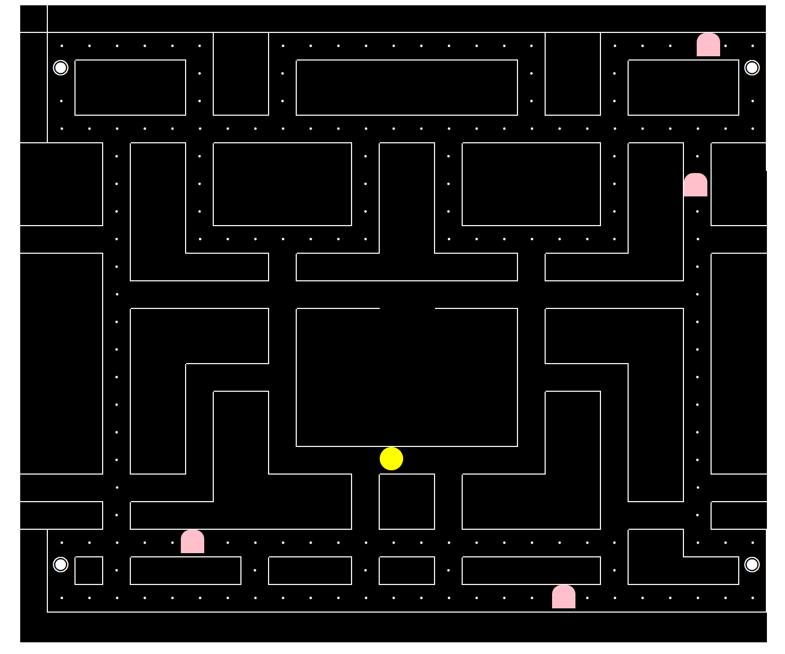

# PacMan Clone

[Link: ] (https://fosachiman.github.io/Projectone/)

Well I decided to make a PacMan clone, and it still needs a lot of work.  Some basic functionality is present, but there are a bunch of things I still would liket to work out.

##Tech used
-HTML
-CSS
-Javascript
-JQuery

##Approach

The first goal was to get PacMan moving.  This was a huge first hurdle for me, because PacMan has a lot of constraints as to where he can go in the maze.  With this in mind, once I got him moving in all four directions, it was time to build the map.

The map, whoa man.  The map was a beast.  The approach here was to build each square on the grid as a separate object with three true/false properties - right wall, lower wall, and has dot.  It was a lengthy process to instantiate each of the objects, because there were 594 of them.

With all of the boxes created, it was then time to add a couple more properties to each of the box objects that give row and column information and to make these properties come to life on the page.  
Then it was time to write the collision detection.  I feel like I did a good job of setting up properties of objects in a way that they were able to talk to each other, making writing the collision detection relatively easy.  The big hurdle here, was getting the detection in the flow of the character movement at the right time.  This proved very difficult.

As you can see, the movement of the characters still is not perfect.  This unfortunately derailed much of the other game features.  

##Improvements to be made

 - Perfecting character movement
 - Big dot functionality
 - Ghost collision detection w/ PacMan
 - Ghost AI
 - Game Reset state
 - General design aesthetic - menus, etc.

##Lessons Learned
Many!  I really sank my teeth into JS with this one, and while there are many shortcomings with how this came together, I do feel like I learned a lot and came out of it a better developer.  I think I should have been more eager to ask for help, as I may have been able to knock out more of the game functionality.  However, I wanted to figure these issues out on my own, and with just the character movement alone, I really came a long way in understanding JS flow and events.
